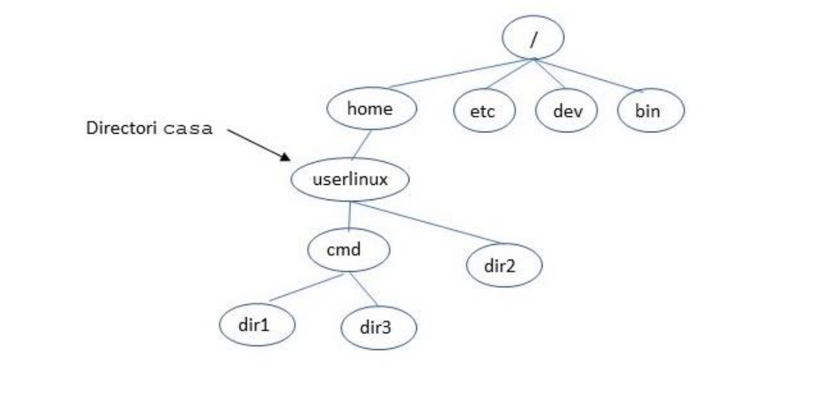
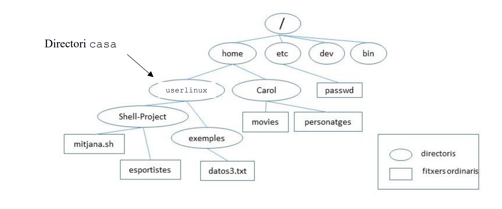

# 🧩 Exercicis Linux-comandes（UAB）题解汇总
> 每题仅用最基础命令（不使用 awk / sed）

---

## 📸 图片 1：目录结构（dir1–dir3–dir4）


---

## 第 1 题
**题目原文：**
«Indica el camí absolut del directori actual.»  
（显示当前目录的绝对路径。）

**解法：**
```bash
pwd
```

**详细解释：**
`pwd` 是 “print working directory” 的缩写，会输出当前目录的完整路径。  
“绝对路径”指从根目录 `/` 开始的路径，如 `/home/usuari/dir2`。

---

## 第 2 题
**题目原文：**
«Des de dir2, torna al directori casa (sense usar el camí absolut).»  
（从 dir2 返回到家目录，不使用绝对路径。）

**解法：**
```bash
cd ~
```

**详细解释：**
`~` 表示当前用户的家目录。  
`cd ~` 或 `cd`（不加参数）都能返回 home。

---

## 第 3 题
**题目原文：**
«Des de dir2, crea dins de dir3 un nou directori anomenat dir4 fent servir un camí relatiu.»  
（从 dir2 出发，用相对路径在 dir3 中创建 dir4。）

**解法：**
```bash
mkdir ../cmd/dir3/dir4
```

**详细解释：**
`mkdir` 创建目录。`..` 表示上一级目录。  
`../cmd/dir3` 即“从 dir2 回上一级 userlinux，再进入 cmd/dir3”。

---

## 第 4 题
**题目原文：**
«Situa’t a dir1 utilitzant el camí absolut.»  
（用绝对路径进入 dir1。）

**解法：**
```bash
cd /home/userlinux/cmd/dir1
```

**详细解释：**
绝对路径以 `/` 开头，不受当前目录影响。

---

## 第 5 题
**题目原文：**
«Des de dir1, torna a dir2 utilitzant un camí relatiu.»  
（从 dir1 返回 dir2，用相对路径。）

**解法：**
```bash
cd ../dir2
```

**详细解释：**
`..` 是上一级目录，`../dir2` 就是“回上一级再进 dir2”。

---

## 第 6 题
**题目原文：**
«Des de dir2, ves a dir1 utilitzant un camí relatiu.»  
（从 dir2 出发，用相对路径进入 dir1。）

**解法：**
```bash
cd ../cmd/dir1
```

**详细解释：**
相对路径通过 `..` 回到上一级，再进入目标。

---

## 第 7 题
**题目原文：**
«Des de dir1, mostra en format llarg el contingut del directori arrel (root).»  
（从 dir1 出发，用长格式列出根目录内容。）

**解法：**
```bash
ls -l /
```

**详细解释：**
`ls` 列出目录，`-l` 显示权限、大小等详细信息。`/` 表示根目录。

---

## 第 8 题
**题目原文：**
«Situa’t a userlinux.»  
（进入 userlinux 目录。）

**解法：**
```bash
cd ../..
```

**详细解释：**
`..` 表示上一级，两次表示上上级。

---

## 第 9 题
**题目原文：**
«Mostra el contingut de userlinux incloent fitxers ocults.»  
（显示 userlinux 的所有文件，包括隐藏文件。）

**解法：**
```bash
ls -la
```

**详细解释：**
`-a` 显示隐藏文件，`-l` 长格式输出。

---

## 第 10 题
**题目原文：**
«Des de userlinux, situa’t a dir2 fent servir el camí absolut.»  
（从 userlinux 用绝对路径进入 dir2。）

**解法：**
```bash
cd /home/userlinux/dir2
```

**详细解释：**
绝对路径始终从根 `/` 开始，精确定位。

---

## 第 11 题
**题目原文：**
«Mostra en format llarg el contingut del directori arrel fent servir el camí absolut.»  
（用绝对路径长格式列出根目录内容。）

**解法：**
```bash
ls -l /
```

**详细解释：**
同第 7 题。

---

## 第 12 题
**题目原文：**
«Torna al directori casa (utilitza una forma diferent de la pregunta 2).»  
（回到 home，用不同方式。）

**解法：**
```bash
cd
```

**详细解释：**
`cd` 不带参数自动回 home，等价于 `cd ~`。

---

## 第 13 题
**题目原文：**
«Mostra la diferència entre les ordres cp practica1 practica2 i cp -r practica1 practica2.»  
（比较 cp 与 cp -r 的区别。）

**解法：**
```bash
cp practica1 practica2
cp -r practica1 practica2
```

**详细解释：**
`cp` 复制文件。  
普通文件可直接复制；目录需加 `-r`（递归）。

---

## 第 14 题
**题目原文：**
«Quina ordre serveix per netejar la pantalla?»  
（清屏命令。）

**解法：**
```bash
clear
```

**详细解释：**
`clear` 清除终端显示，不删历史或文件。快捷键：`Ctrl + L`。

---

## 第 15 题
**题目原文：**
«Explica la diferència entre rmdir practica, rm practica i rm -r practica.»  
（解释三种删除命令区别。）

**解法：**
```bash
rmdir practica
rm practica
rm -r practica
```

**详细解释：**
- `rmdir` 仅删空目录；  
- `rm` 删文件；  
- `rm -r` 递归删除目录及内容（危险操作）。

---

## 第 16 题
**题目原文：**
«Indicar el nombre de línies del fitxer file1 que comencen per la lletra ‘a’.»  
（统计 file1 中以 a 开头的行数。）

**解法：**
```bash
grep "^a" file1 > linies_a
wc -l linies_a
```

**详细解释：**
`grep "^a"` 匹配行首 a；输出到 linies_a；`wc -l` 统计行数。

---

## 第 17 题
**题目原文：**
«Crea el fitxer file1bis igual que file1, però amb els dos primers camps intercanviats.»  
（创建 file1bis，与 file1 相同，但前两列互换。）

**解法（基础思路）：**
手动分割并重组字段。若无 awk/sed，只能说明：  
使用 `cut -d:` 提取字段，再 `paste` 拼接。

---

## 第 18 题
**题目原文：**
«Modifica la primera columna de la línia 24 del fitxer file1bis, substituint-la per “AAA”.»  
（修改第 24 行的第 1 列为 AAA。）

**解法（原始法）：**
```bash
head -n 23 file1bis > part1
echo "AAA:..." >> part1
tail -n +25 file1bis >> part1
mv part1 file1bis
```

**详细解释：**
用 `head` 保留前 23 行，`echo` 插入新行，`tail` 拼接剩余行。

---

## 第 19 题
**题目原文：**
（多步骤操作，基于 Carol 与 Shell-Project 目录结构）

**预留图片：**


详细见子题：
- 回家目录 → `cd ..`
- 查看路径 → `pwd`
- 创建目录 practica → `mkdir practica`
- 进入 Shell-Project → `cd /home/userlinux/Shell-Project`
- 创建文件 → `echo "examen" > examen.txt`
- 追加文件 → `cat esportistes >> examen.txt`
- 返回 Carol → `cd ../Carol`
- 复制目录 → `cp -r . ../Shell-Project/exemples/`
- 查看 → `ls -l exemples`
- 查找 Barcelona → `grep "Barcelona$" esportistes`
- 排序 → `ls | sort`
- 追加 FINAL → `echo "FINAL" >> ../Shell-Project/mitjana.sh`
- 查找 Iron Man → `grep "Iron Man" personatges`
- 去掉 Iron Man → `grep -v "Iron Man" personatges > versio2`
- 回家目录 → `cd`

---

## 第 20 题（选择题）

a) 显示不以 A 开头的文件：
```bash
ls | grep -v "^A"
```

b) 显示第 5~10 行：
```bash
head -n 10 fitxer | tail -n 6
```

c) 将行数存入变量：
```bash
lin=$(cat dades | wc -l)
```

d) 切到当前目录：
```bash
cd ./
```

e) 显示空行：
```bash
grep "^$" fitxer
```

f) 显示两个文件内容：
```bash
cat fitxer1 fitxer2
```

---

> 📘 本文对应《Exercicis Linux-comandes》全部题目（第 1–20 题），
> 题图见上方两张结构图（dir2 & Carol-Shell-Project）。
